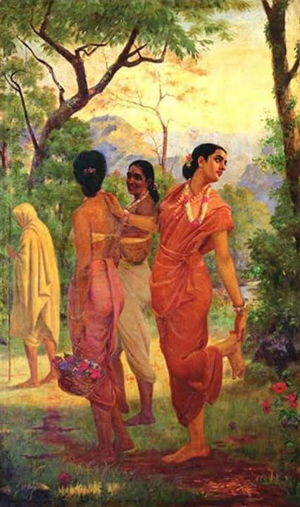
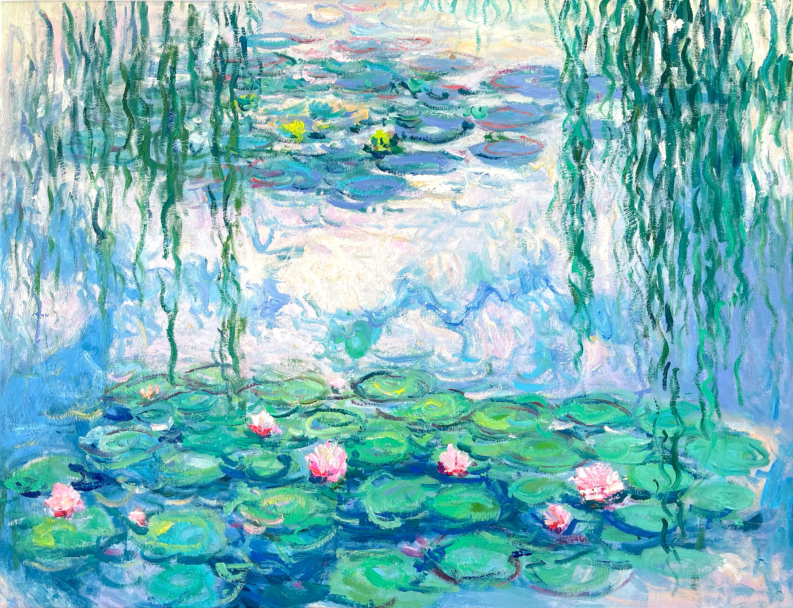
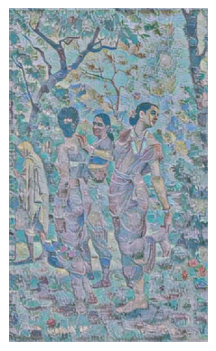
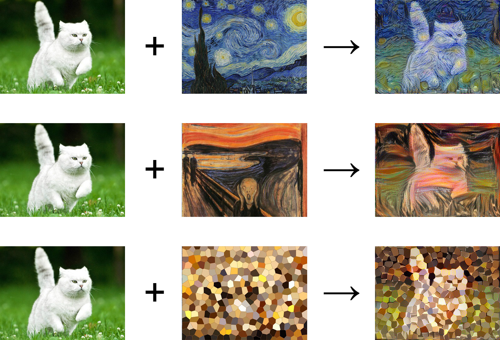
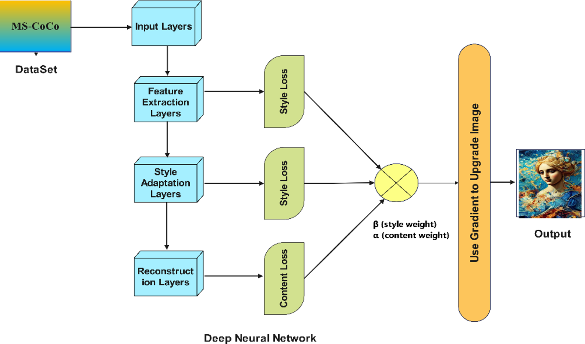

<div align="center">

# 🎨 The Cross-Cultural AI Art Studio
**A Neural Style Transfer Engine built with Python & TensorFlow**

[](https://www.python.org/)
[](https://www.tensorflow.org/)
[](https://colab.research.google.com/)

https://github.com/user-attachments/assets/d8ce2279-8597-4be7-999b-f0ef8749b80b

</div>

---

## 💡 The Vision

What happens when you take the sweeping, classical realism of 19th-century Indian master painter **Raja Ravi Varma** and force an Artificial Intelligence to repaint it using the soft, light-dappled impressionism of French icon **Claude Monet**?

This project is a lightweight, cloud-based **Neural Style Transfer (NST)** studio. It uses a Convolutional Neural Network (CNN) to mathematically study the physical geometry of a photograph, extract the brushstrokes of a famous painting, and synthesize a brand-new masterpiece from scratch.

---

## 📸 The Gallery: Cross-Cultural Synthesis

The AI completely preserves the structural geometry and human silhouette of the content image, but completely replaces the textures, lighting, and colors with the style image.

| The Content (Structure) | The Style (Texture) | The Output (Masterpiece) |
| :---: | :---: | :---: |
|  <br> *Shakuntala* (Raja Ravi Varma) |  <br> *Water Lilies* (Claude Monet) |  <br> **✨ Cross-Cultural Synthesis ✨** |

> **Note:** Want to try it yourself? You can use your morning coffee, your dog, or a famous monument. The model adapts to anything!

<br>
<div align="center">
  
  <br>
  <i>An ordinary photograph synthesized with an impressionist canvas to create a stunning, stylized masterpiece.</i>
</div>

---

## 🏛️ System Architecture: Under the Hood

To understand how the machine "paints", we have to look inside the neural network.

<div align="center">
  
  <br>
  <i>The Convolutional Neural Network separating Structure (Content) from Texture (Style).</i>
</div>

### How the Model "Sees" Art
When an image passes through a **Convolutional Neural Network (CNN)** (specifically the VGG network architecture), the pixels are filtered through dozens of mathematical layers:

* **Shallow Layers (The Style):** The first few layers of the network act like magnifying glasses. They only notice tiny, localized details—the grain of a canvas, the curve of a single brushstroke, or a specific shade of teal. We extract the *correlations* between these features using a mathematical tool called a **Gram Matrix**. 
* **Deep Layers (The Content):** As the image moves deeper into the network, the AI drops the microscopic details and starts mapping the "big picture"—the shape of a nose, the outline of a saree, or the geometry of a room.

By calculating the mathematical difference (loss) between the Deep Layers of our photo and the Shallow Layers of our painting, we can force a blank digital canvas to slowly morph into a perfect hybrid of both!

---

## 🧠 The Science: Seminal Research Papers

This codebase doesn't just use basic color filters; it is built on the shoulders of two monumental breakthroughs in Computer Vision. 

**1. The Foundation: Feature Separation**
> 📄 [**A Neural Algorithm of Artistic Style** (Gatys et al., 2015)](https://arxiv.org/abs/1508.06576)

Leon Gatys and his team were the first to prove that the representations of *content* and *style* in a CNN are mathematically separable. By manipulating both independently, they birthed the entire field of Neural Style Transfer.

**2. The Speed Upgrade: Conditional Instance Normalization**
> 📄 [**Exploring the structure of a real-time, arbitrary neural artistic stylization network** (Ghiasi et al., 2017)](https://arxiv.org/abs/1705.06830)

The original Gatys method was incredibly slow, taking minutes to generate a single image because it had to run a heavy optimization loop every single time. The Google Brain (Magenta) team solved this by training a network to predict "style parameters" instantly. This is the exact model our code pulls from TensorFlow Hub, allowing us to generate high-res art in milliseconds using *any* arbitrary style!

---

## 🚀 Run It Yourself (Zero Setup Required)

You don't need a heavy gaming GPU to run this. We are deploying the model straight into [**Google Colab**](https://colab.research.google.com/drive/19axzk8MrPAORxQZbX8Y1kTANvzy3qhnz?usp=sharing), allowing you to run it entirely in your web browser for free.

### The 4-Step Quickstart:
1. **Open the Notebook:** Click the `.ipynb` file in this repository and open it in Google Colab.
2. **Boot the Brain:** Run the first cell to download the pre-trained Magenta model from TensorFlow Hub.
3. **Upload Your Muses:** Colab will prompt you to upload two images from your computer (`content` and `style`).
4. **Cast the Spell:** Run the final cell. The math takes about 5 seconds!

```python
# The core logic is beautifully simple:
stylized_image = model(tf.constant(content_image), tf.constant(style_image))[0]
